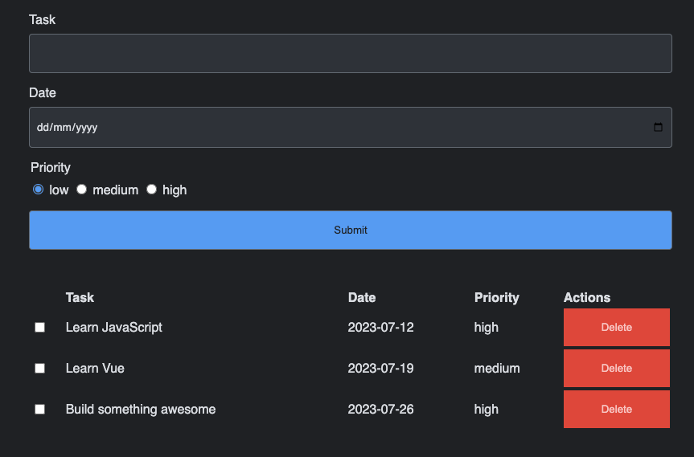

# IndexedDB Demo

This repository holds the code showcasing the IndexedDB. You can [view the demo here](https://indexed-db-demo.davebitter.com/).

## Getting started

- Run `yarn` | `npm install` to install all needed dependencies
- Run `yarn dev` | `npm run dev` to run the development environment
- Run `yarn build` | `npm run build` to create a production build

## Development setup

This project uses [Parcel](https://parceljs.org/) to develop and build. Refer to their documentation to get up to speed on how to work with it.
